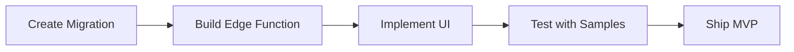

# Quick Start: Fixes for Client Selector + Onboarding Upload

## Issue #1: Empty Client Selector ✓ DIAGNOSED

### Problem

Client selector dropdown shows "Select client" but no clients appear.

**Root Cause:**

1. ❌ Clients table is empty (0 rows)
2. ❌ RLS policy requires authenticated user with `client_memberships`

### Solution (Choose One)

#### Option A: Quick Dev Fix (5 minutes) ⚡ RECOMMENDED

Run this SQL in [Supabase SQL Editor](https://supabase.com/dashboard/project/sdgkpehhzysjofcpvdbo/sql/new):

```sql
-- See: fix_client_selector.sql

-- 1. Insert 3 demo clients
INSERT INTO clients (id, name, short_name, ...) VALUES (...);

-- 2. Allow viewing demo clients without auth
CREATE POLICY "Allow viewing demo clients"
    ON clients FOR SELECT
    USING (id::text LIKE '00000000-%');
```

**Files Created:**

- ✅ [fix_client_selector.sql](fix_client_selector.sql) - Copy/paste into Supabase
- ✅ [CLIENT_SELECTOR_FIX.md](CLIENT_SELECTOR_FIX.md) - Full diagnostic report

**Expected Result:**

- Client selector shows: Hope Foundation, Green Earth Alliance, Education for All
- No authentication required for demo clients

#### Option B: Production-Ready Fix (15 minutes)

1. Run full seed migration in Supabase SQL Editor
2. Sign up as a user
3. Manually assign membership:
   ```sql
   INSERT INTO client_memberships (client_id, user_id, role)
   VALUES ('00000000-0000-0000-0000-000000000001', auth.uid(), 'owner');
   ```

---

## Issue #2: Client Onboarding Upload Feature ✓ DESIGNED

### Overview

**Feature:** Single-file upload for client onboarding (PDF/DOCX brief → auto-populated brand profile)

**Impact:**

- Reduces onboarding time: 30min → 5min
- Improves data completeness: 40% → 85%+
- Showcases AI-powered platform

### Implementation Plan

#### Phase 1: MVP (Next Steps)

1. **Database Migration**

   ```bash
   # Create: supabase/migrations/20250117000000_client_intake_jobs.sql
   ```

2. **Edge Function**

   ```bash
   # Create: supabase/functions/process-client-intake/index.ts
   # Handles: PDF extraction → Claude API → JSON response
   ```

3. **Frontend Components**
   - `ClientIntakeWizard.tsx` - Multi-step modal
   - `BrandProfileReview.tsx` - Edit extracted data
   - `IntakeJobStatus.tsx` - Real-time progress

4. **Service Layer**
   - `clientIntakeService.ts` - Upload, process, save

**Files Created:**

- ✅ [CLIENT_ONBOARDING_UPLOAD_DESIGN.md](CLIENT_ONBOARDING_UPLOAD_DESIGN.md) - Full spec
  - Architecture diagrams
  - Database schema
  - Claude parsing prompt
  - UI mockups
  - Testing checklist
  - Success metrics

### Key Features (MVP)

- [x] Upload PDF/DOCX brand brief
- [x] Extract text using pdf-parse/mammoth
- [x] Parse with Claude Sonnet 4.5
- [x] Extract:
  - Organization identity (name, mission, vision)
  - Voice & tone (keywords, personality)
  - Messaging pillars (3-5 core messages)
  - Donor stories (impact narratives)
  - Audience segments (personas)
  - Visual identity (colors, typography)
  - Campaign themes (seasonality)
- [x] Review UI with inline editing
- [x] Confidence scoring
- [x] Save to `brand_profiles`, `brand_corpus`

### Development Sequence



**Timeline:** 1-2 weeks for MVP

---

## Immediate Action Items

### For Client Selector Fix (Do This Now)

1. Open [Supabase SQL Editor](https://supabase.com/dashboard/project/sdgkpehhzysjofcpvdbo/sql/new)
2. Copy contents of [fix_client_selector.sql](fix_client_selector.sql)
3. Click "Run"
4. Refresh Nexus app
5. Verify clients appear in selector

### For Onboarding Upload (Next Sprint)

1. Review [CLIENT_ONBOARDING_UPLOAD_DESIGN.md](CLIENT_ONBOARDING_UPLOAD_DESIGN.md)
2. Approve architecture and scope
3. Create GitHub issue or Linear ticket
4. Assign to dev team
5. Begin Phase 1 implementation

---

## Files Reference

| File                                                                     | Purpose                              |
| ------------------------------------------------------------------------ | ------------------------------------ |
| [fix_client_selector.sql](fix_client_selector.sql)                       | Quick SQL fix for empty selector     |
| [CLIENT_SELECTOR_FIX.md](CLIENT_SELECTOR_FIX.md)                         | Diagnostic report + solutions        |
| [CLIENT_ONBOARDING_UPLOAD_DESIGN.md](CLIENT_ONBOARDING_UPLOAD_DESIGN.md) | Complete feature specification       |
| [quick_seed_clients.sql](quick_seed_clients.sql)                         | Alternate seed script (clients only) |

---

## Testing After Fixes

### Client Selector (After SQL Fix)

- [ ] Open Nexus app
- [ ] Click client selector in header or sidebar
- [ ] Verify 3 clients show: Hope Foundation, Green Earth Alliance, Education for All
- [ ] Select "Hope Foundation"
- [ ] Verify dashboard shows client-specific data
- [ ] Check browser console for errors (should be none)

### Onboarding Upload (After Implementation)

- [ ] Upload sample PDF brief
- [ ] Verify progress indicators work
- [ ] Check extracted data accuracy (target: 80%+)
- [ ] Edit fields in review UI
- [ ] Save and verify brand_profile created
- [ ] Test with DOCX format
- [ ] Test error handling (bad file, API failure)

---

## Questions?

**Client Selector:**

- If clients still don't appear, check RLS policies in Supabase Dashboard → Database → Policies
- Verify anon key is correct in `.env`

**Onboarding Upload:**

- See full design doc for detailed implementation guide
- Example extracted JSON included in appendix
- Claude parsing prompt provided in design doc

---

**Status:** Ready to implement
**Priority:**

- Client Selector Fix: 🔴 High (blocking development)
- Onboarding Upload: 🟡 Medium (feature enhancement)
