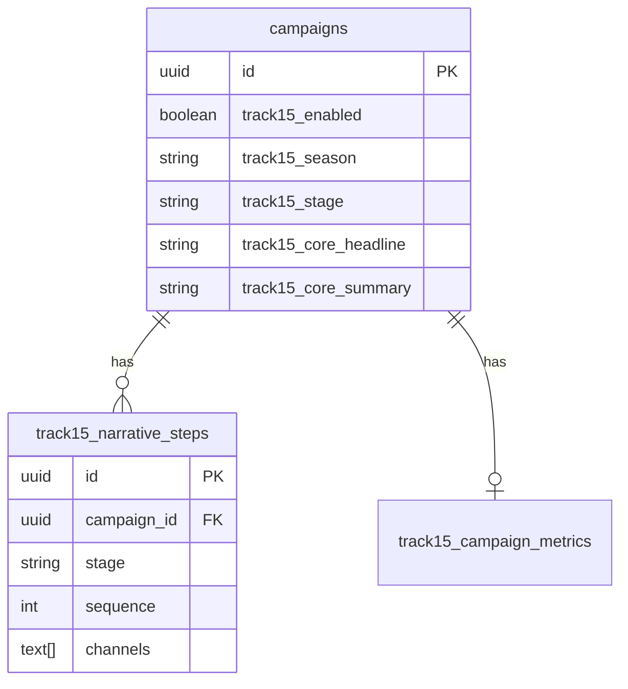

# Phase 6: Track15 Integration - GitHub Issues

## Issue #1: Wire Track15 Wizard into Campaign Builder

**Labels:** `enhancement`, `track15`, `high-priority`

### Description
Integrate the Track15 wizard steps (Season Selection, Core Story Builder, Narrative Arc Builder) into the campaign creation flow.

### Acceptance Criteria
- [ ] `Track15CampaignWizard.tsx` panel created with step composition
- [ ] Wizard state management includes `Track15CampaignMeta` slice
- [ ] "Finish" button workflow:
  - Creates/ensures base campaign record
  - Calls `enableTrack15(campaignId, season, templateKey)`
  - Calls `updateCoreStory(campaignId, draft.coreStory)`
  - Calls `bulkUpdateNarrativeSteps(campaignId, draft.narrativeSteps)`
- [ ] Route added: `/clients/:clientId/campaigns/new?track15=true`
- [ ] "New Track15 Campaign" button in `CampaignEngineSection.tsx`
- [ ] Redirect to campaign detail after successful creation

### Technical Details
**Files to Create:**
- `src/panels/Track15CampaignWizard.tsx`
- `src/components/campaign/wizard-steps/BasicsStep.tsx` (if needed)
- `src/components/campaign/wizard-steps/ReviewStep.tsx`

**Files to Modify:**
- `src/app/AppRoutes.tsx` - Add Track15 wizard route
- `src/components/dashboard/CampaignEngineSection.tsx` - Add "New Track15 Campaign" CTA
- `src/pages/client/CampaignBuilder.tsx` - Handle `?track15=true` query param

**Service Calls Sequence:**
```typescript
// 1. Create base campaign (if new)
const campaignId = await createCampaign({ name, clientId });

// 2. Enable Track15
await enableTrack15(campaignId, season, templateKey);

// 3. Save core story
await updateCoreStory(campaignId, coreStory);

// 4. Save narrative steps
await bulkUpdateNarrativeSteps(campaignId, narrativeSteps);

// 5. Navigate to campaign
navigate(`/clients/${clientId}/campaigns/${campaignId}`);
```

### Dependencies
- Existing wizard steps already built
- `track15Service.ts` methods already implemented
- Database migrations already applied

---

## Issue #2: Connect Track15 Analytics to Real Data

**Labels:** `enhancement`, `track15`, `analytics`

### Description
Replace mock data in Track15 analytics components with real service calls and hook implementations.

### Acceptance Criteria
- [ ] `useTrack15Metrics` hook created
  - Accepts `campaignId`
  - Returns `{ metrics, isLoading, error }`
- [ ] `useTrack15Segments` hook created
  - Accepts `campaignId`
  - Returns `{ segments, isLoading, error }`
- [ ] Mock data removed from all components:
  - `Track15LiftMetrics.tsx`
  - `Track15SegmentPerformance.tsx`
  - `Track15RetentionChart.tsx` (already using real hook)
- [ ] `Track15AnalyticsPanel.tsx` wired to selected campaign
- [ ] Campaign selector dropdown added (if needed)
- [ ] Loading states properly displayed
- [ ] Error states properly handled

### Technical Details
**Files to Create:**
- `src/hooks/useTrack15Metrics.ts`
- `src/hooks/useTrack15Segments.ts`

**Files to Modify:**
- `src/panels/Track15AnalyticsPanel.tsx`
- `src/components/analytics/Track15LiftMetrics.tsx`
- `src/components/analytics/Track15SegmentPerformance.tsx`

**Service Methods to Implement/Verify:**
- `track15Service.getLiftMetrics(campaignId)` ✅ Already implemented
- `track15Service.getRetentionSeries(campaignId)` ✅ Already implemented
- `track15Service.getSegmentPerformance(campaignId)` ⚠️ **Needs implementation**

### Hook Implementation Example
```typescript
// src/hooks/useTrack15Metrics.ts
export function useTrack15Metrics(campaignId: string | null) {
  const [metrics, setMetrics] = useState<Track15LiftMetrics | null>(null);
  const [isLoading, setIsLoading] = useState(false);
  const [error, setError] = useState<string | null>(null);

  useEffect(() => {
    if (!campaignId) return;

    setIsLoading(true);
    getLiftMetrics(campaignId)
      .then(setMetrics)
      .catch(err => setError(err.message))
      .finally(() => setIsLoading(false));
  }, [campaignId]);

  return { metrics, isLoading, error };
}
```

### Backend Implementation Needed
- [ ] Implement `getSegmentPerformance(campaignId)` in `track15Service.ts`
  - Query donations grouped by donor segment
  - Calculate metrics per segment
  - Return `SegmentPerformanceData[]`

---

## Issue #3: Add Navigation Links for Track15

**Labels:** `enhancement`, `track15`, `ux`

### Description
Add navigation links and CTAs to make Track15 features easily discoverable.

### Acceptance Criteria
- [ ] Sidebar link to Track15 Analytics
  - Location: Under "Analytics" section
  - Label: "Track15 Performance"
  - Icon: Sparkles or TrendingUp
  - Route: `/clients/:clientId/track15`
- [ ] Campaign Engine CTAs:
  - "Design Track15 Campaign" button → Track15 wizard
  - "View Track15 Analytics" link (for active Track15 campaigns)
- [ ] Knowledge Base CTA:
  - "Create Track15 Campaign" button linking KB to wizard
  - Tooltip: "Use your knowledge base to power Track15 campaigns"

### Technical Details
**Files to Modify:**
- `src/components/nav/Sidebar.tsx`
- `src/components/dashboard/CampaignEngineSection.tsx`
- `src/panels/KnowledgeBasePanel.tsx`

**Sidebar Addition:**
```typescript
{
  label: "Track15 Performance",
  path: `/clients/${clientId}/track15`,
  icon: Sparkles,
  badge: track15CampaignCount > 0 ? `${track15CampaignCount}` : undefined
}
```

**Campaign Engine CTA:**
```typescript
<button
  onClick={() => navigate(`/clients/${clientId}/campaigns/new?track15=true`)}
  className="flex items-center gap-2 px-4 py-2 bg-purple-600 text-white rounded-lg"
>
  <Sparkles className="w-4 h-4" />
  New Track15 Campaign
</button>
```

---

## Issue #4: Track15 Integration Tests

**Labels:** `testing`, `track15`, `critical`

### Description
Comprehensive integration tests for Track15 campaign creation, narrative steps, and analytics.

### Acceptance Criteria

#### Campaign Creation Tests
- [ ] Create Track15 campaign via wizard
- [ ] Verify `track15_enabled = true`
- [ ] Verify `track15_season` matches selection
- [ ] Verify `track15_stage = 'not_started'` initially
- [ ] Verify core story fields populated
- [ ] Verify stage transitions correctly

#### Narrative Steps Tests
- [ ] Create steps across all 5 stages
- [ ] Verify DB rows with correct `stage`, `sequence`, `channels`
- [ ] Update step → verify changes persisted
- [ ] Delete step → verify removed from DB
- [ ] Bulk update → verify all steps replaced correctly

#### Analytics Tests
- [ ] Seed test metrics and retention data
- [ ] Lift metrics render with correct baseline/current
- [ ] Segment performance renders all segments
- [ ] Retention chart handles:
  - No data (empty state)
  - Single period
  - Multiple periods
- [ ] Loading states display correctly
- [ ] Error states display correctly

#### Access Control (RLS) Tests
- [ ] User A cannot access User B's Track15 campaigns
- [ ] User A cannot view User B's narrative steps
- [ ] User A cannot view User B's metrics
- [ ] Proper 403/404 responses for unauthorized access

### Technical Details
**Test Files to Create:**
- `src/__tests__/track15/campaignCreation.test.ts`
- `src/__tests__/track15/narrativeSteps.test.ts`
- `src/__tests__/track15/analytics.test.ts`
- `src/__tests__/track15/rls.test.ts`

**Testing Tools:**
- Jest for unit tests
- React Testing Library for component tests
- Supabase local dev for RLS tests
- MSW (Mock Service Worker) for API mocking

**Example Test:**
```typescript
describe('Track15 Campaign Creation', () => {
  it('should create campaign with Track15 enabled', async () => {
    const campaignId = await createCampaign({ name: 'Test', clientId });
    await enableTrack15(campaignId, 'spring', 'annual_fund');

    const { data } = await supabase
      .from('campaigns')
      .select('track15_enabled, track15_season, track15_stage')
      .eq('id', campaignId)
      .single();

    expect(data.track15_enabled).toBe(true);
    expect(data.track15_season).toBe('spring');
    expect(data.track15_stage).toBe('not_started');
  });
});
```

---

## Issue #5: Track15 Documentation

**Labels:** `documentation`, `track15`

### Description
Create comprehensive user and developer documentation for Track15 features.

### Acceptance Criteria

#### User Guide (`docs/TRACK15_USER_GUIDE.md`)
- [ ] What is Track15?
- [ ] How to create a Track15 campaign (step-by-step)
- [ ] Season selection guide
  - When to use each season
  - Template descriptions
- [ ] Core story best practices
  - Headline tips
  - Donor motivation selection
  - Value proposition examples
- [ ] Narrative arc design
  - 5-stage journey explanation
  - Channel selection guidance
  - Segment targeting tips
- [ ] Analytics interpretation
  - Lift metrics explained
  - Segment performance insights
  - Retention trends analysis

#### API Documentation (`docs/TRACK15_API.md`)
- [ ] Service methods reference
- [ ] Request/response examples for each method
- [ ] Authentication & authorization notes
- [ ] Error handling patterns
- [ ] Rate limiting (if applicable)

#### Data Model Documentation (`docs/TRACK15_DATA_MODEL.md`)
- [ ] Database schema diagrams
- [ ] Table descriptions:
  - `campaigns` extensions
  - `track15_narrative_steps`
  - `track15_campaign_metrics`
- [ ] Column definitions and constraints
- [ ] RLS policies explanation
- [ ] Helper functions documentation
- [ ] Indexes and performance notes

### Technical Details
**Files to Create:**
- `docs/TRACK15_USER_GUIDE.md`
- `docs/TRACK15_API.md`
- `docs/TRACK15_DATA_MODEL.md`
- `docs/assets/track15/` (screenshots/diagrams folder)

**Documentation Tools:**
- Mermaid.js for diagrams
- Screenshots of UI components
- Code examples with syntax highlighting

**Example Diagram (Mermaid):**


---

## Implementation Priority

### Week 1: Core Functionality
1. ✅ Issue #1: Wire Track15 Wizard (2-3 days)
2. ✅ Issue #2: Connect Analytics (1-2 days)

### Week 2: UX & Testing
3. ✅ Issue #3: Navigation Links (0.5 days)
4. ✅ Issue #4: Integration Tests (2-3 days)

### Week 3: Documentation
5. ✅ Issue #5: Documentation (1-2 days)

---

## Success Metrics

- [ ] Track15 campaigns can be created end-to-end without errors
- [ ] Analytics dashboard displays real data with <2s load time
- [ ] All navigation paths to Track15 features are intuitive
- [ ] Test coverage >80% for Track15 features
- [ ] Documentation allows new developer to understand Track15 in <30 min

---

*Created: 2025-01-13*
