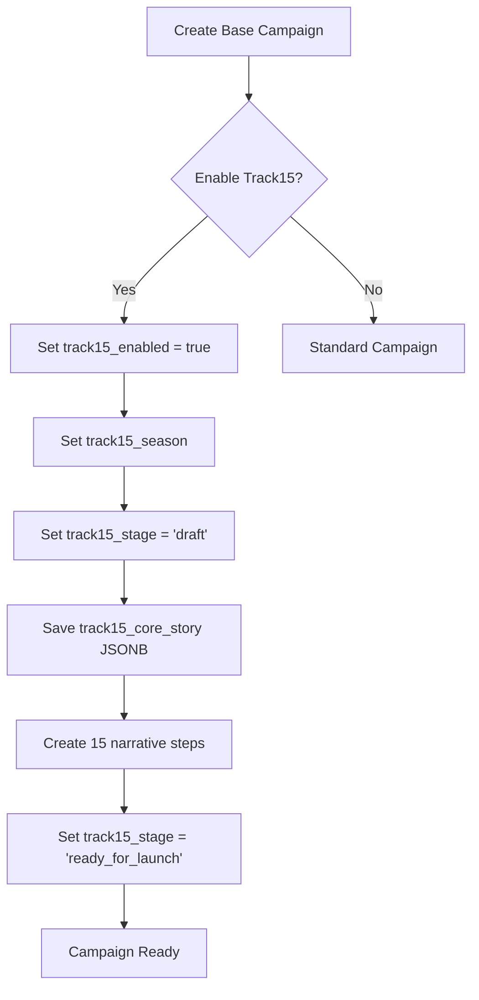
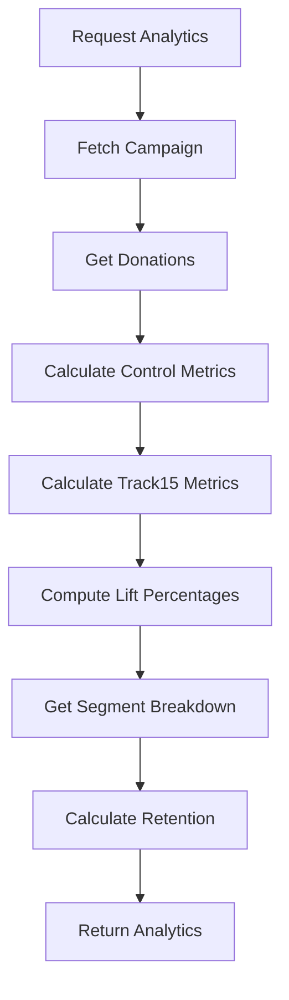

# Track15 Data Model Documentation

**Version:** 1.0
**Last Updated:** 2025-01-14

---

## Table of Contents

1. [Overview](#overview)
2. [Database Schema](#database-schema)
3. [Table Relationships](#table-relationships)
4. [Data Flow](#data-flow)
5. [RLS Policies](#rls-policies)
6. [Migrations](#migrations)
7. [Data Integrity](#data-integrity)

---

## Overview

The Track15 data model extends the existing Nexus campaigns system to support the Track15 methodology. It consists of:

- **Campaign Extensions**: Additional fields on the `campaigns` table
- **Narrative Steps Table**: Stores the 15 touchpoints
- **Donor Segments**: RFM segmentation for personalization
- **Analytics Views**: Calculated metrics for performance tracking

### Design Principles

1. **Non-Breaking**: All extensions are optional; standard campaigns unaffected
2. **JSONB for Flexibility**: Core story stored as JSONB for easy evolution
3. **Referential Integrity**: Foreign keys with CASCADE deletes
4. **Audit Trails**: Created/updated timestamps on all tables
5. **Performance**: Indexes on frequently queried fields

---

## Database Schema

### campaigns Table (Extended)

The existing `campaigns` table is extended with Track15-specific fields.

```sql
-- Existing campaigns table with Track15 extensions
CREATE TABLE campaigns (
  -- Standard campaign fields (existing)
  id UUID PRIMARY KEY DEFAULT gen_random_uuid(),
  client_id UUID NOT NULL REFERENCES clients(id) ON DELETE CASCADE,
  name VARCHAR(255) NOT NULL,
  description TEXT,
  goal_amount DECIMAL(12,2),
  start_date DATE,
  end_date DATE,
  status VARCHAR(50) DEFAULT 'draft',
  created_at TIMESTAMPTZ DEFAULT NOW(),
  updated_at TIMESTAMPTZ DEFAULT NOW(),

  -- Track15 enablement
  track15_enabled BOOLEAN DEFAULT FALSE,
  track15_season VARCHAR(20),  -- 'spring' | 'summer' | 'fall' | 'year_end'
  track15_stage VARCHAR(30),   -- 'draft' | 'ready_for_launch' | 'active' | 'paused' | 'completed'
  track15_template_key VARCHAR(100),

  -- Core story (JSONB)
  track15_core_story JSONB,
  /* Structure:
  {
    "headline": "Feed 500 Families This Spring",
    "summary": "Every $50 provides...",
    "value_proposition": "Your $50 gift...",
    "donor_motivation": "Because every child..."
  }
  */

  -- Performance metrics (calculated)
  track15_control_conversion DECIMAL(5,4),     -- e.g., 0.0320 = 3.2%
  track15_test_conversion DECIMAL(5,4),        -- e.g., 0.0480 = 4.8%
  track15_control_revenue DECIMAL(12,2),       -- Expected without Track15
  track15_test_revenue DECIMAL(12,2),          -- Actual with Track15

  -- Timestamps
  track15_activated_at TIMESTAMPTZ,            -- When campaign went live
  track15_completed_at TIMESTAMPTZ             -- When 15-day window ended
);

-- Indexes for Track15 queries
CREATE INDEX idx_campaigns_track15_enabled
  ON campaigns(track15_enabled)
  WHERE track15_enabled = TRUE;

CREATE INDEX idx_campaigns_track15_season
  ON campaigns(track15_season)
  WHERE track15_season IS NOT NULL;

CREATE INDEX idx_campaigns_track15_stage
  ON campaigns(track15_stage)
  WHERE track15_stage IS NOT NULL;

CREATE INDEX idx_campaigns_client_track15
  ON campaigns(client_id, track15_enabled)
  WHERE track15_enabled = TRUE;
```

### Field Definitions

| Field | Type | Nullable | Default | Description |
|-------|------|----------|---------|-------------|
| `track15_enabled` | BOOLEAN | No | FALSE | Whether Track15 methodology is enabled |
| `track15_season` | VARCHAR(20) | Yes | NULL | Seasonal template: 'spring', 'summer', 'fall', 'year_end' |
| `track15_stage` | VARCHAR(30) | Yes | NULL | Campaign stage in workflow |
| `track15_template_key` | VARCHAR(100) | Yes | NULL | Template identifier for pre-built arcs |
| `track15_core_story` | JSONB | Yes | NULL | Core story elements (headline, summary, etc.) |
| `track15_control_conversion` | DECIMAL(5,4) | Yes | NULL | Control group conversion rate |
| `track15_test_conversion` | DECIMAL(5,4) | Yes | NULL | Track15 group conversion rate |
| `track15_control_revenue` | DECIMAL(12,2) | Yes | NULL | Expected revenue without Track15 |
| `track15_test_revenue` | DECIMAL(12,2) | Yes | NULL | Actual revenue with Track15 |
| `track15_activated_at` | TIMESTAMPTZ | Yes | NULL | Campaign activation timestamp |
| `track15_completed_at` | TIMESTAMPTZ | Yes | NULL | Campaign completion timestamp |

### Validation Rules

**track15_season:**
```sql
ALTER TABLE campaigns
  ADD CONSTRAINT chk_track15_season
  CHECK (track15_season IN ('spring', 'summer', 'fall', 'year_end'));
```

**track15_stage:**
```sql
ALTER TABLE campaigns
  ADD CONSTRAINT chk_track15_stage
  CHECK (track15_stage IN ('draft', 'ready_for_launch', 'active', 'paused', 'completed'));
```

**Conversion rates (0-1 range):**
```sql
ALTER TABLE campaigns
  ADD CONSTRAINT chk_track15_conversion_range
  CHECK (
    (track15_control_conversion IS NULL OR track15_control_conversion BETWEEN 0 AND 1) AND
    (track15_test_conversion IS NULL OR track15_test_conversion BETWEEN 0 AND 1)
  );
```

**Revenue must be non-negative:**
```sql
ALTER TABLE campaigns
  ADD CONSTRAINT chk_track15_revenue_positive
  CHECK (
    (track15_control_revenue IS NULL OR track15_control_revenue >= 0) AND
    (track15_test_revenue IS NULL OR track15_test_revenue >= 0)
  );
```

---

### track15_narrative_steps Table

Stores the 15 touchpoints that comprise a Track15 campaign's narrative arc.

```sql
CREATE TABLE track15_narrative_steps (
  id UUID PRIMARY KEY DEFAULT gen_random_uuid(),
  campaign_id UUID NOT NULL REFERENCES campaigns(id) ON DELETE CASCADE,
  step_number INTEGER NOT NULL CHECK (step_number BETWEEN 1 AND 15),
  stage VARCHAR(20) NOT NULL CHECK (stage IN ('awareness', 'engagement', 'consideration', 'conversion', 'gratitude')),
  day INTEGER NOT NULL CHECK (day BETWEEN 1 AND 15),
  subject_line TEXT NOT NULL,
  message TEXT NOT NULL,
  call_to_action TEXT NOT NULL,
  segment_customization JSONB,
  /* Structure:
  {
    "Champions": { "subject_line": "...", "emphasis": "..." },
    "Loyal": { "subject_line": "...", "emphasis": "..." },
    ...
  }
  */
  created_at TIMESTAMPTZ DEFAULT NOW(),
  updated_at TIMESTAMPTZ DEFAULT NOW(),

  UNIQUE(campaign_id, step_number)
);

-- Indexes
CREATE INDEX idx_track15_narrative_steps_campaign
  ON track15_narrative_steps(campaign_id);

CREATE INDEX idx_track15_narrative_steps_stage
  ON track15_narrative_steps(stage);

CREATE INDEX idx_track15_narrative_steps_day
  ON track15_narrative_steps(day);
```

### Field Definitions

| Field | Type | Nullable | Constraints | Description |
|-------|------|----------|-------------|-------------|
| `id` | UUID | No | PK | Unique step identifier |
| `campaign_id` | UUID | No | FK → campaigns | Parent campaign |
| `step_number` | INTEGER | No | 1-15, UNIQUE per campaign | Step sequence number |
| `stage` | VARCHAR(20) | No | awareness \| engagement \| consideration \| conversion \| gratitude | Which narrative stage |
| `day` | INTEGER | No | 1-15 | Which day of campaign |
| `subject_line` | TEXT | No | - | Email subject line |
| `message` | TEXT | No | - | Core message content |
| `call_to_action` | TEXT | No | - | What donor should do |
| `segment_customization` | JSONB | Yes | NULL | Per-segment message variations |
| `created_at` | TIMESTAMPTZ | No | NOW() | Creation timestamp |
| `updated_at` | TIMESTAMPTZ | No | NOW() | Last update timestamp |

### Stage Distribution

| Stage | Step Numbers | Days | Purpose |
|-------|--------------|------|---------|
| awareness | 1-3 | 1-3 | Introduce mission, build trust |
| engagement | 4-6 | 4-6 | Share stories, create connection |
| consideration | 7-10 | 7-10 | Present opportunities, address objections |
| conversion | 11-13 | 11-13 | Direct ask, build urgency |
| gratitude | 14-15 | 14-15 | Thank donors, share impact |

**Typical Distribution:**
- Awareness: 3 steps (20%)
- Engagement: 3 steps (20%)
- Consideration: 4 steps (27%)
- Conversion: 3 steps (20%)
- Gratitude: 2 steps (13%)

---

### donors Table (RFM Segmentation)

Existing `donors` table extended with RFM segment for Track15 personalization.

```sql
-- Existing donors table with RFM extension
CREATE TABLE donors (
  id UUID PRIMARY KEY DEFAULT gen_random_uuid(),
  client_id UUID NOT NULL REFERENCES clients(id) ON DELETE CASCADE,
  email VARCHAR(255) NOT NULL,
  first_name VARCHAR(100),
  last_name VARCHAR(100),

  -- RFM Segmentation (for Track15)
  rfm_segment VARCHAR(30),
  /* Values:
    'Champions' - Recent, frequent, high-value
    'Loyal' - Consistent across years
    'Potential Loyalists' - Recent, showing promise
    'New Donors' - First-time contributors
    'Promising' - Moderate frequency/value
    'Need Attention' - Declining engagement
    'At Risk' - Haven't given recently
  */
  rfm_recency_score INTEGER CHECK (rfm_recency_score BETWEEN 1 AND 5),
  rfm_frequency_score INTEGER CHECK (rfm_frequency_score BETWEEN 1 AND 5),
  rfm_monetary_score INTEGER CHECK (rfm_monetary_score BETWEEN 1 AND 5),
  rfm_last_calculated TIMESTAMPTZ,

  created_at TIMESTAMPTZ DEFAULT NOW(),
  updated_at TIMESTAMPTZ DEFAULT NOW()
);

CREATE INDEX idx_donors_rfm_segment
  ON donors(rfm_segment)
  WHERE rfm_segment IS NOT NULL;

CREATE INDEX idx_donors_client_rfm
  ON donors(client_id, rfm_segment);
```

### RFM Scoring Logic

**Recency (R):**
- 5: Donated within last 30 days
- 4: 31-90 days ago
- 3: 91-180 days ago
- 2: 181-365 days ago
- 1: >365 days ago

**Frequency (F):**
- 5: 10+ donations
- 4: 6-9 donations
- 3: 3-5 donations
- 2: 2 donations
- 1: 1 donation

**Monetary (M):**
- 5: $1000+ total
- 4: $500-999
- 3: $200-499
- 2: $50-199
- 1: <$50

### Segment Assignment

| Segment | R | F | M | Description |
|---------|---|---|---|-------------|
| Champions | 4-5 | 4-5 | 4-5 | Best donors |
| Loyal | 3-5 | 3-5 | 3-5 | Consistent |
| Potential Loyalists | 4-5 | 1-3 | 1-3 | Recent, promising |
| New Donors | 4-5 | 1 | 1-2 | First gift |
| Promising | 3-4 | 2-3 | 2-3 | Moderate |
| Need Attention | 2-3 | 2-4 | 2-4 | Declining |
| At Risk | 1-2 | 1-3 | 1-3 | Lapsed |

---

## Table Relationships

### Entity Relationship Diagram

```
clients
  │
  ├─── campaigns
  │      │
  │      ├─── track15_narrative_steps (1:15)
  │      │
  │      └─── donations (1:many)
  │
  └─── donors (1:many)
         │
         └─── donations (1:many)
```

### Relationships Detail

**clients → campaigns**
- Type: One-to-Many
- FK: `campaigns.client_id → clients.id`
- Delete: CASCADE (deleting client removes all campaigns)

**campaigns → track15_narrative_steps**
- Type: One-to-Many (exactly 15 for Track15 campaigns)
- FK: `track15_narrative_steps.campaign_id → campaigns.id`
- Delete: CASCADE (deleting campaign removes all steps)
- Unique Constraint: `(campaign_id, step_number)`

**campaigns → donations**
- Type: One-to-Many
- FK: `donations.campaign_id → campaigns.id`
- Delete: SET NULL (preserve donations even if campaign deleted)

**donors → donations**
- Type: One-to-Many
- FK: `donations.donor_id → donors.id`
- Delete: CASCADE (deleting donor removes donation records)

**clients → donors**
- Type: One-to-Many
- FK: `donors.client_id → clients.id`
- Delete: CASCADE (deleting client removes all donors)

---

## Data Flow

### Campaign Creation Flow



### Activation Flow

```mermaid
graph TD
    A[User Clicks Activate] --> B[Validate Prerequisites]
    B --> C{All Steps Created?}
    C -->|No| D[Error: Incomplete]
    C -->|Yes| E[Set track15_stage = 'active']
    E --> F[Set track15_activated_at = NOW()]
    F --> G[Begin Touchpoint Schedule]
    G --> H[Monitor Performance]
```

### Analytics Calculation Flow



### Data Updates

**Campaign Updates:**
```sql
-- Trigger to auto-update updated_at
CREATE OR REPLACE FUNCTION update_updated_at_column()
RETURNS TRIGGER AS $$
BEGIN
  NEW.updated_at = NOW();
  RETURN NEW;
END;
$$ LANGUAGE plpgsql;

CREATE TRIGGER update_campaigns_updated_at
  BEFORE UPDATE ON campaigns
  FOR EACH ROW
  EXECUTE FUNCTION update_updated_at_column();

CREATE TRIGGER update_track15_narrative_steps_updated_at
  BEFORE UPDATE ON track15_narrative_steps
  FOR EACH ROW
  EXECUTE FUNCTION update_updated_at_column();
```

**RFM Recalculation:**
```sql
-- Function to recalculate RFM segments
CREATE OR REPLACE FUNCTION recalculate_rfm_segments(p_client_id UUID)
RETURNS void AS $$
BEGIN
  UPDATE donors d
  SET
    rfm_recency_score = calculate_recency_score(d.id),
    rfm_frequency_score = calculate_frequency_score(d.id),
    rfm_monetary_score = calculate_monetary_score(d.id),
    rfm_segment = assign_rfm_segment(
      calculate_recency_score(d.id),
      calculate_frequency_score(d.id),
      calculate_monetary_score(d.id)
    ),
    rfm_last_calculated = NOW()
  WHERE d.client_id = p_client_id;
END;
$$ LANGUAGE plpgsql;
```

---

## RLS Policies

Row Level Security (RLS) ensures users can only access their organization's data.

### campaigns Table Policies

```sql
-- Enable RLS
ALTER TABLE campaigns ENABLE ROW LEVEL SECURITY;

-- Users can view campaigns for their client
CREATE POLICY "Users can view own client campaigns"
  ON campaigns FOR SELECT
  USING (
    client_id IN (
      SELECT client_id FROM user_clients WHERE user_id = auth.uid()
    )
  );

-- Users can insert campaigns for their client
CREATE POLICY "Users can create campaigns for own client"
  ON campaigns FOR INSERT
  WITH CHECK (
    client_id IN (
      SELECT client_id FROM user_clients WHERE user_id = auth.uid()
    )
  );

-- Users can update campaigns for their client
CREATE POLICY "Users can update own client campaigns"
  ON campaigns FOR UPDATE
  USING (
    client_id IN (
      SELECT client_id FROM user_clients WHERE user_id = auth.uid()
    )
  );

-- Users can delete campaigns for their client
CREATE POLICY "Users can delete own client campaigns"
  ON campaigns FOR DELETE
  USING (
    client_id IN (
      SELECT client_id FROM user_clients WHERE user_id = auth.uid()
    )
  );
```

### track15_narrative_steps Table Policies

```sql
ALTER TABLE track15_narrative_steps ENABLE ROW LEVEL SECURITY;

-- Users can view narrative steps for their campaigns
CREATE POLICY "Users can view own campaign narrative steps"
  ON track15_narrative_steps FOR SELECT
  USING (
    campaign_id IN (
      SELECT id FROM campaigns
      WHERE client_id IN (
        SELECT client_id FROM user_clients WHERE user_id = auth.uid()
      )
    )
  );

-- Users can insert/update/delete steps for their campaigns
CREATE POLICY "Users can manage own campaign narrative steps"
  ON track15_narrative_steps FOR ALL
  USING (
    campaign_id IN (
      SELECT id FROM campaigns
      WHERE client_id IN (
        SELECT client_id FROM user_clients WHERE user_id = auth.uid()
      )
    )
  );
```

### donors Table Policies

```sql
ALTER TABLE donors ENABLE ROW LEVEL SECURITY;

-- Users can view donors for their client
CREATE POLICY "Users can view own client donors"
  ON donors FOR SELECT
  USING (
    client_id IN (
      SELECT client_id FROM user_clients WHERE user_id = auth.uid()
    )
  );

-- Similar policies for INSERT, UPDATE, DELETE
```

---

## Migrations

### Initial Track15 Schema Migration

**File:** `supabase/migrations/20250113000002_track15_extensions.sql`

```sql
-- ============================================================================
-- Track15 Extensions Migration
-- Extends campaigns table and adds narrative steps table
-- ============================================================================

BEGIN;

-- Add Track15 fields to campaigns table
ALTER TABLE campaigns
  ADD COLUMN IF NOT EXISTS track15_enabled BOOLEAN DEFAULT FALSE,
  ADD COLUMN IF NOT EXISTS track15_season VARCHAR(20),
  ADD COLUMN IF NOT EXISTS track15_stage VARCHAR(30),
  ADD COLUMN IF NOT EXISTS track15_template_key VARCHAR(100),
  ADD COLUMN IF NOT EXISTS track15_core_story JSONB,
  ADD COLUMN IF NOT EXISTS track15_control_conversion DECIMAL(5,4),
  ADD COLUMN IF NOT EXISTS track15_test_conversion DECIMAL(5,4),
  ADD COLUMN IF NOT EXISTS track15_control_revenue DECIMAL(12,2),
  ADD COLUMN IF NOT EXISTS track15_test_revenue DECIMAL(12,2),
  ADD COLUMN IF NOT EXISTS track15_activated_at TIMESTAMPTZ,
  ADD COLUMN IF NOT EXISTS track15_completed_at TIMESTAMPTZ;

-- Add constraints
ALTER TABLE campaigns
  ADD CONSTRAINT chk_track15_season
    CHECK (track15_season IN ('spring', 'summer', 'fall', 'year_end'));

ALTER TABLE campaigns
  ADD CONSTRAINT chk_track15_stage
    CHECK (track15_stage IN ('draft', 'ready_for_launch', 'active', 'paused', 'completed'));

ALTER TABLE campaigns
  ADD CONSTRAINT chk_track15_conversion_range
    CHECK (
      (track15_control_conversion IS NULL OR track15_control_conversion BETWEEN 0 AND 1) AND
      (track15_test_conversion IS NULL OR track15_test_conversion BETWEEN 0 AND 1)
    );

ALTER TABLE campaigns
  ADD CONSTRAINT chk_track15_revenue_positive
    CHECK (
      (track15_control_revenue IS NULL OR track15_control_revenue >= 0) AND
      (track15_test_revenue IS NULL OR track15_test_revenue >= 0)
    );

-- Create indexes
CREATE INDEX IF NOT EXISTS idx_campaigns_track15_enabled
  ON campaigns(track15_enabled) WHERE track15_enabled = TRUE;

CREATE INDEX IF NOT EXISTS idx_campaigns_track15_season
  ON campaigns(track15_season) WHERE track15_season IS NOT NULL;

CREATE INDEX IF NOT EXISTS idx_campaigns_track15_stage
  ON campaigns(track15_stage) WHERE track15_stage IS NOT NULL;

CREATE INDEX IF NOT EXISTS idx_campaigns_client_track15
  ON campaigns(client_id, track15_enabled) WHERE track15_enabled = TRUE;

-- Create track15_narrative_steps table
CREATE TABLE IF NOT EXISTS track15_narrative_steps (
  id UUID PRIMARY KEY DEFAULT gen_random_uuid(),
  campaign_id UUID NOT NULL REFERENCES campaigns(id) ON DELETE CASCADE,
  step_number INTEGER NOT NULL CHECK (step_number BETWEEN 1 AND 15),
  stage VARCHAR(20) NOT NULL CHECK (stage IN ('awareness', 'engagement', 'consideration', 'conversion', 'gratitude')),
  day INTEGER NOT NULL CHECK (day BETWEEN 1 AND 15),
  subject_line TEXT NOT NULL,
  message TEXT NOT NULL,
  call_to_action TEXT NOT NULL,
  segment_customization JSONB,
  created_at TIMESTAMPTZ DEFAULT NOW(),
  updated_at TIMESTAMPTZ DEFAULT NOW(),

  UNIQUE(campaign_id, step_number)
);

-- Create indexes for narrative steps
CREATE INDEX IF NOT EXISTS idx_track15_narrative_steps_campaign
  ON track15_narrative_steps(campaign_id);

CREATE INDEX IF NOT EXISTS idx_track15_narrative_steps_stage
  ON track15_narrative_steps(stage);

CREATE INDEX IF NOT EXISTS idx_track15_narrative_steps_day
  ON track15_narrative_steps(day);

-- Create updated_at trigger for narrative steps
CREATE TRIGGER update_track15_narrative_steps_updated_at
  BEFORE UPDATE ON track15_narrative_steps
  FOR EACH ROW
  EXECUTE FUNCTION update_updated_at_column();

-- Add RLS policies for track15_narrative_steps
ALTER TABLE track15_narrative_steps ENABLE ROW LEVEL SECURITY;

CREATE POLICY "Users can view own campaign narrative steps"
  ON track15_narrative_steps FOR SELECT
  USING (
    campaign_id IN (
      SELECT id FROM campaigns
      WHERE client_id IN (
        SELECT client_id FROM user_clients WHERE user_id = auth.uid()
      )
    )
  );

CREATE POLICY "Users can manage own campaign narrative steps"
  ON track15_narrative_steps FOR ALL
  USING (
    campaign_id IN (
      SELECT id FROM campaigns
      WHERE client_id IN (
        SELECT client_id FROM user_clients WHERE user_id = auth.uid()
      )
    )
  );

COMMIT;
```

### RFM Segmentation Migration

**File:** `supabase/migrations/20250113000003_rfm_segmentation.sql`

```sql
-- ============================================================================
-- RFM Segmentation Migration
-- Adds RFM scoring to donors table
-- ============================================================================

BEGIN;

-- Add RFM fields to donors table
ALTER TABLE donors
  ADD COLUMN IF NOT EXISTS rfm_segment VARCHAR(30),
  ADD COLUMN IF NOT EXISTS rfm_recency_score INTEGER CHECK (rfm_recency_score BETWEEN 1 AND 5),
  ADD COLUMN IF NOT EXISTS rfm_frequency_score INTEGER CHECK (rfm_frequency_score BETWEEN 1 AND 5),
  ADD COLUMN IF NOT EXISTS rfm_monetary_score INTEGER CHECK (rfm_monetary_score BETWEEN 1 AND 5),
  ADD COLUMN IF NOT EXISTS rfm_last_calculated TIMESTAMPTZ;

-- Add constraint for valid segments
ALTER TABLE donors
  ADD CONSTRAINT chk_rfm_segment
    CHECK (rfm_segment IN (
      'Champions',
      'Loyal',
      'Potential Loyalists',
      'New Donors',
      'Promising',
      'Need Attention',
      'At Risk'
    ));

-- Create indexes
CREATE INDEX IF NOT EXISTS idx_donors_rfm_segment
  ON donors(rfm_segment) WHERE rfm_segment IS NOT NULL;

CREATE INDEX IF NOT EXISTS idx_donors_client_rfm
  ON donors(client_id, rfm_segment);

COMMIT;
```

---

## Data Integrity

### Constraints Summary

**Primary Keys:**
- All tables have UUID primary keys
- Generated via `gen_random_uuid()`

**Foreign Keys:**
- All relationships enforced via FK constraints
- Cascade deletes where appropriate
- Prevent orphaned records

**Check Constraints:**
- Step numbers: 1-15
- Days: 1-15
- Conversion rates: 0-1
- Revenue: non-negative
- Enum values validated

**Unique Constraints:**
- `(campaign_id, step_number)` on narrative steps
- Prevents duplicate steps per campaign

### Data Validation

**Application-Level:**
```typescript
// Validate before insert
function validateNarrativeStep(step: Track15NarrativeStep): boolean {
  if (step.step_number < 1 || step.step_number > 15) return false;
  if (step.day < 1 || step.day > 15) return false;
  if (!step.subject_line || !step.message || !step.call_to_action) return false;
  if (!['awareness', 'engagement', 'consideration', 'conversion', 'gratitude'].includes(step.stage)) return false;
  return true;
}
```

**Database-Level:**
- CHECK constraints enforce ranges
- NOT NULL constraints enforce required fields
- FK constraints enforce relationships

### Backup Strategy

**Automated Backups:**
- Supabase automatic daily backups
- Point-in-time recovery available
- 7-day retention (free tier)

**Manual Backups:**
```bash
# Export campaigns with Track15 data
pg_dump -h db.supabase.co -U postgres \
  -t campaigns -t track15_narrative_steps \
  -f track15_backup.sql nexus_db
```

**Restore:**
```bash
psql -h db.supabase.co -U postgres nexus_db < track15_backup.sql
```

---

## Performance Considerations

### Query Optimization

**Common Queries:**

**1. Fetch Track15 campaigns for client:**
```sql
-- Optimized with idx_campaigns_client_track15
SELECT * FROM campaigns
WHERE client_id = $1 AND track15_enabled = TRUE
ORDER BY created_at DESC;
```

**2. Fetch campaign with narrative steps:**
```sql
-- Optimized with idx_track15_narrative_steps_campaign
SELECT
  c.*,
  json_agg(ns ORDER BY ns.step_number) AS narrative_steps
FROM campaigns c
LEFT JOIN track15_narrative_steps ns ON ns.campaign_id = c.id
WHERE c.id = $1
GROUP BY c.id;
```

**3. Segment performance analysis:**
```sql
-- Optimized with idx_donors_rfm_segment
SELECT
  d.rfm_segment,
  COUNT(DISTINCT d.id) AS donor_count,
  SUM(dn.amount) AS total_gifts,
  AVG(dn.amount) AS avg_gift_size
FROM donations dn
JOIN donors d ON d.id = dn.donor_id
WHERE dn.campaign_id = $1
GROUP BY d.rfm_segment;
```

### Index Maintenance

**Monitor Index Usage:**
```sql
SELECT
  schemaname,
  tablename,
  indexname,
  idx_scan,
  idx_tup_read,
  idx_tup_fetch
FROM pg_stat_user_indexes
WHERE tablename IN ('campaigns', 'track15_narrative_steps', 'donors')
ORDER BY idx_scan DESC;
```

**Identify Missing Indexes:**
```sql
SELECT
  schemaname,
  tablename,
  attname,
  n_distinct,
  correlation
FROM pg_stats
WHERE tablename IN ('campaigns', 'track15_narrative_steps')
  AND n_distinct > 100;
```

---

## Appendix

### Sample Data

**Track15 Campaign:**
```json
{
  "id": "c1a2b3c4-d5e6-7f8g-9h0i-1j2k3l4m5n6o",
  "client_id": "client-uuid-123",
  "name": "Spring Food Security 2025",
  "goal_amount": 50000.00,
  "start_date": "2025-03-15",
  "end_date": "2025-03-29",
  "track15_enabled": true,
  "track15_season": "spring",
  "track15_stage": "active",
  "track15_core_story": {
    "headline": "Feed 500 Families This Spring",
    "summary": "Every $50 provides a week of groceries for a family facing food insecurity.",
    "value_proposition": "Your $50 gift provides tangible, measurable impact.",
    "donor_motivation": "Because every child deserves to go to bed with a full stomach."
  },
  "track15_control_conversion": 0.0320,
  "track15_test_conversion": 0.0480,
  "track15_control_revenue": 45230.00,
  "track15_test_revenue": 67845.00
}
```

**Narrative Step:**
```json
{
  "id": "step-uuid-123",
  "campaign_id": "c1a2b3c4-d5e6-7f8g-9h0i-1j2k3l4m5n6o",
  "step_number": 1,
  "stage": "awareness",
  "day": 1,
  "subject_line": "Meet the families we serve",
  "message": "Introduction to community need and the families our food pantry supports...",
  "call_to_action": "Learn more about our food pantry",
  "segment_customization": {
    "Champions": {
      "subject_line": "Welcome back! Meet the families you're helping",
      "emphasis": "ongoing_partnership"
    },
    "New Donors": {
      "subject_line": "Meet the families we serve together",
      "emphasis": "introduction"
    }
  }
}
```

---

## Additional Resources

- [Track15 User Guide](TRACK15_USER_GUIDE.md)
- [Track15 API Documentation](TRACK15_API.md)
- [Integration Testing Plan](ISSUE_4_TESTING_PLAN.md)
- [Supabase RLS Documentation](https://supabase.com/docs/guides/auth/row-level-security)
- [PostgreSQL JSONB Documentation](https://www.postgresql.org/docs/current/datatype-json.html)

---

*Last Updated: 2025-01-14*
*Version: 1.0*
*© 2025 Nexus. All rights reserved.*
